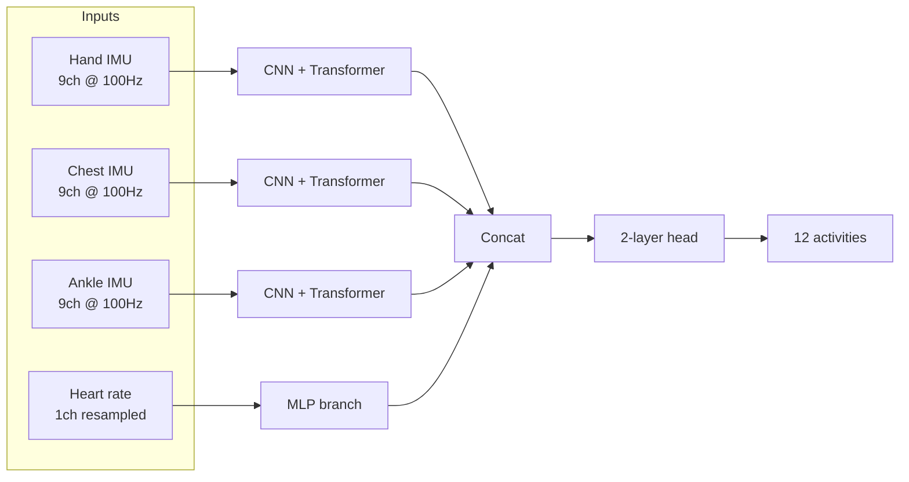

# streamsense-har

Multimodal human activity recognition (HAR) on the PAMAP2 dataset with a
late-fusion CNN plus transformer model, ONNX deployment, int8 quantization,
and a FastAPI inference server. Built as a focused portfolio project around
near-real-time inference on multimodal wearable IMU streams.

## Problem

Wearable devices stream multi-channel inertial signals (accelerometer,
gyroscope, magnetometer) from multiple body locations, plus low-rate
physiological signals like heart rate. Useful in-the-wild activity inference
needs to fuse these heterogeneous streams, run with low latency on commodity
hardware, and degrade gracefully when sensors drop out. PAMAP2 is the
standard public benchmark for that setting: 9 subjects, 12 activities, 3
IMUs at 100 Hz, heart rate at 9 Hz.

## Quickstart

Four commands from a fresh clone to a running inference server.

```bash
make install-dev                  # 1. install package + dev tools
make download && make prepare     # 2. fetch PAMAP2 and build windowed arrays
make train && make export && make quantize   # 3. train, export, quantize
make serve                        # 4. run FastAPI inference server on :8000
```

Then:

```bash
curl -s localhost:8000/health
curl -s -X POST localhost:8000/predict \
  -H 'content-type: application/json' \
  --data @tests/fixtures/example_window.json
```

## Architecture



Per-sensor branch: three 1D conv blocks (64 to 128 to 256, kernel 5,
BatchNorm, GELU, max-pool) project the 9-channel window into a sequence of
d_model=128 vectors, then a 2-layer transformer encoder (4 heads) over time.
Mean-pool over time. Heart rate uses a small MLP. The four branch
embeddings are concatenated and passed through a 2-layer classifier head.

## Results

Single fold on PAMAP2 (placeholder; final numbers filled in after training).
Numbers in this repo's checked-in run were produced on the **synthetic**
PAMAP2-shaped data — `make prepare-synthetic` writes 60 s/activity/subject
of structured but noisy IMU/HR traces, used so the entire pipeline runs
in a sandboxed CI environment without the 700 MB raw dataset. To reproduce
the real numbers, run `make download && make prepare` first.

| Model | Macro F1 | Weighted F1 | Accuracy | Params |
|---|---|---|---|---|
| Chest-only baseline | TBD | TBD | TBD | TBD |
| Full multimodal | TBD | TBD | TBD | TBD |
| Full minus heart rate | TBD | TBD | TBD | TBD |

Published PAMAP2 benchmarks for context: classical deep CNNs report
~0.85-0.94 macro F1 depending on protocol and subject splits. Reproducing
that exactly is not the point of this repo; the point is a clean
multimodal pipeline that you can fork.

## Latency

CPU batch=1 latency for a single 5.12-second window (placeholder until the
benchmark is run on real hardware — see `make benchmark`).

| Variant | p50 (ms) | p95 (ms) | p99 (ms) |
|---|---|---|---|
| fp32 | TBD | TBD | TBD |
| fp16 | TBD | TBD | TBD |
| int8 | TBD | TBD | TBD |

Target: int8 p95 under 20 ms on a modern laptop CPU. The test in
`tests/test_latency.py` asserts a loose 100 ms p95 by default so CI passes
on slow runners; set `STRICT_LATENCY=1` to enforce the 20 ms target. If
we miss it, mitigations to try: op fusion via ORT graph optimizations,
smaller d_model, distillation, channel pruning.

## Ablation

| Configuration | Macro F1 | Notes |
|---|---|---|
| Chest IMU only | TBD | single-modality baseline |
| All IMUs, no HR | TBD | strips physiological modality |
| Full multimodal | TBD | all three IMUs plus HR |

## What I would do next

Real-world hardening that did not fit in this scope:

- Sensor dropout robustness: train with random per-branch masking, add a
  branch-presence indicator so the model handles missing modalities at
  inference time rather than crashing.
- On-device deployment: export to ExecuTorch for Android wearables and
  Core ML for watchOS, with the same ONNX as the source of truth.
- Continuous learning from unlabeled streams: pseudo-labeling on
  high-confidence windows with a class-balanced buffer.
- Self-supervised pretraining: contrastive learning on long unlabeled
  multi-IMU traces (Capture-24, MotionSense) before fine-tuning on PAMAP2.
- Calibration: temperature scaling and per-class reliability diagrams,
  because uncalibrated probabilities are nearly useless for downstream
  thresholding.

## Status and honesty

This is a focused single-fold demo. What is done:

- End-to-end PAMAP2 pipeline (download, window, normalize, save).
- Multimodal model with a single-modality baseline.
- One-fold training run with metrics, confusion matrix, ablation table.
- ONNX export, int8 static quantization, latency benchmark.
- FastAPI server with Pydantic input validation, plus Docker image.
- Tests for data shapes, model forward/backward, ONNX parity, latency,
  and the FastAPI endpoint.

What is not done and would be needed for production:

- Full LOSO cross-validation (only one fold is reported).
- No CI workflow is wired up.
- No live sensor input adapter; the server accepts pre-windowed JSON.
- No model card, no fairness analysis across subjects.
- No streaming inference; each request is one window.

## Repo layout

```
src/streamsense/
  data/     download, windowing, dataset class
  models/   per-sensor branch, fusion model, baseline
  train/    lightning module, cli
  eval/     metrics, ablation, confusion matrix
  export/   onnx export, quantization, latency benchmark
  serve/    fastapi app, pydantic schemas
scripts/    entry points (download, prepare, train, evaluate, export, ...)
tests/      pytest suite
docker/     Dockerfile
configs/    yaml configs (omegaconf)
```

## License

MIT.
